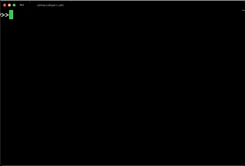
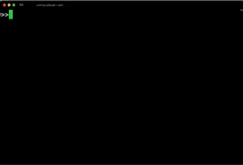

# kpad

### A Kubernetes manifests editor.

Kpad is a simple multiplatform terminal editor born to edit kubernetes declarative manifest yaml files.

It has **syntax highlighting** and provides a handy **auto-complete** that pops up a list of possible context-aware fields at the cursor position.




## autocompletion configuration

If you work using the plain "kubectl" CLI from your console, then kpad should work on the fly.

Behind the scenes, kpad calls "kubectl explain" to populate the auto-complete list, so it is also aware of your custom kubernetes objects in your cluster, and provides autocompletion for them.

If in your cluster you use something different from the plain "kubectl" CLI command, you can configure if in kpad launching `kpad -c` and change the configuration there.

For example if you use "MicroK8s", then launch `kpad -c` and change like this:
```
kubectl: microk8s kubectl
```

## kpad honours your KUBECONFIG
If you wish to use kpad to edit kubernetes manifests from other clusters, and you have the "kubeconfig" file for those clusters, you can point to that cluster by setting the `KUBECONFIG` environment variable to the path of that file, and then kpad would connect to that cluster to provide auto-completion. 


## make kpad the default kubernetes manifests editor

To make kpad your default kubernetes manifests editor, set the "KUBE_EDITOR" environment variable to the path where kpad is.
In linux, for example:
`export KUBE_EDITOR=/<path>/<to>/kpad`




Kpad is still work-in-progress, although it is pretty stable and quite fast.
- It is written in go. 
- It's pretty lightweight.
- It compiles for Mac, Win, Linux.
- It also supports wide characters (2x width on the terminal).
- It even runs on my phone.

There could be bugs, and you are welcome to contribute with fixes,enhancements,features,etc.


